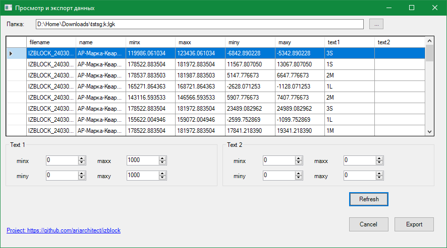

  

# IZBLOCK Utility

A Windows utility for viewing and processing block data extracted from AutoCAD drawings (DWG) and stored as XML files.  
The project is designed to simplify the analysis and export of block information, primarily for use in architectural and engineering workflows.

## Features

- Browse a folder and automatically load all XML files matching the `IZBLOCK_*.xml` pattern.
- View extracted block information in a scrollable, non-editable table.
- Filter and combine block text values using customizable coordinate-based selectors.
- Export processed data to Excel for further use or reporting.
- Modern one-window WinForms interface in Material Design style.

## How It Works

1. Select a folder containing `IZBLOCK_*.xml` files.
2. The utility loads and merges block data, associating each block with its source file.
3. Texts from each block can be filtered based on coordinate ranges set in the interface.
4. The results are displayed in a table and can be exported to Excel.

## Example Use Case

- Quickly aggregate text attributes from multiple DWG files for quality control or reporting.
- Identify and extract information from blocks by location, for construction documentation.

## Plans / Roadmap

- **Manual:** Documentation for expoerting from DWG (not covered yet)
- **LISP builder:** A LISP script to automate the export of block data to IZBLOCK XML format.
- **Custom Exports:** CSV and direct DWG block manipulation.
- **User Presets:** Profiles and settings for different user types.
- **Integration:** Direct AutoCAD plugin or command for exporting IZBLOCK XMLs.
- **Cross-platform:** Experiment with .NET MAUI or Avalonia for Linux/Mac builds.

## Repository

[https://github.com/ariarchitect/izblock](https://github.com/ariarchitect/izblock)

---

  

## Requirements
pip install pythonnet pandas openpyxl pyperclip 

*Feedback and pull requests are welcome!*
